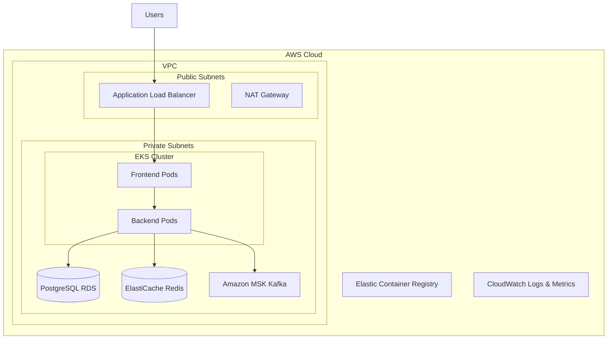

# Raally SaaS - DevOps & Infrastructure

This repository demonstrates enterprise-grade DevOps practices applied to the Raally resource allocation application, showcasing modern cloud-native architecture with Kubernetes, microservices patterns, and Infrastructure as Code.

## 🏗️ Architecture Overview

### Technology Stack

**Core Application:**

- **Frontend:** React 18 + TypeScript + Nginx
- **Backend:** Node.js + Express.js + TypeScript
- **Database:** PostgreSQL (AWS RDS) + SQLite (local development)

**DevOps & Infrastructure:**

- **Containerization:** Docker with multi-stage builds
- **Orchestration:** Kubernetes (Amazon EKS)
- **Message Queue:** Apache Kafka (Amazon MSK)
- **Cache:** Redis (Amazon ElastiCache)
- **Infrastructure as Code:** Terraform
- **Container Registry:** Amazon ECR
- **Load Balancing:** AWS Application Load Balancer
- **Monitoring:** CloudWatch + Prometheus + Grafana

### Infrastructure Components



## 🚀 Quick Start

### Prerequisites

- Docker & Docker Compose
- AWS CLI configured
- kubectl
- Terraform >= 1.0
- Node.js 20+

### Local Development

1. **Clone and Setup:**

```bash
git clone <repository>
cd raally-app
```

2.**Start with Docker Compose:**

```bash
# Start all services (Kafka, Redis, App)
docker-compose up -d

# View logs
docker-compose logs -f

# Stop services
docker-compose down
```

3.**Access Services:**

- Frontend: <http://localhost:80>
- Backend API: <http://localhost:3001/api>
- Health Check: <http://localhost:3001/api/health>
- Kafka UI: <http://localhost:8080>
- Redis Insight: <http://localhost:8001>

### Production Deployment

1. **Infrastructure Provisioning:**

```bash
cd terraform/environments/production

# Initialize Terraform
terraform init

# Plan infrastructure
terraform plan -var-file="terraform.tfvars"

# Apply infrastructure
terraform apply -var-file="terraform.tfvars"
```

2.**Application Deployment:**

```bash
# Configure kubectl
aws eks update-kubeconfig --region us-west-2 --name raally-production-cluster

# Deploy application
kubectl apply -k k8s/overlays/production

# Check deployment status
kubectl get pods -n raally
kubectl get svc -n raally
```

## 📦 Docker Configuration

### Multi-Stage Builds

**Backend Dockerfile Features:**

- Multi-stage build for optimization
- Non-root user for security
- Health checks
- Proper dependency caching
- Production-ready configuration

**Frontend Dockerfile Features:**

- React build optimization
- Nginx with security headers
- Gzip compression
- Static asset caching
- Health check endpoint

### Docker Compose Services

- **Zookeeper:** Coordination service for Kafka
- **Kafka:** Message streaming with auto-topic creation
- **Redis:** Caching and session storage
- **Backend:** Node.js API with health checks
- **Frontend:** React app with Nginx
- **Kafka UI:** Development interface for Kafka
- **Redis Insight:** Development interface for Redis

## ☸️ Kubernetes Deployment

### Architecture

**Namespace:** `raally`

**Deployments:**

- **Frontend:** 2 replicas, nginx-based
- **Backend:** 3 replicas with HPA (3-10 pods)
- **Redis:** 1 replica with persistent storage
- **Kafka:** 3 brokers with Zookeeper

**Services:**

- ClusterIP services for internal communication
- Application Load Balancer for external access

**Storage:**

- Persistent volumes for Redis, Kafka, and database
- AWS EBS GP2 storage class

### High Availability

- **Multi-AZ deployment** across 3 availability zones
- **Horizontal Pod Autoscaling** based on CPU/memory
- **Rolling updates** with zero downtime
- **Health checks** for liveness and readiness
- **Resource limits** and requests defined

### Security

- **Network policies** for traffic segmentation
- **RBAC** for service account permissions
- **Secrets management** for sensitive data
- **Security contexts** for container security
- **TLS encryption** for all communications

## 🌩️ AWS Infrastructure

### Terraform Modules

**VPC Module:**

- 3 public subnets for load balancers
- 3 private subnets for applications
- 3 database subnets for RDS
- NAT gateways for outbound traffic
- Flow logs for monitoring

**EKS Module:**

- Managed node groups with auto-scaling
- Multiple instance types (general + compute)
- Spot instances for cost optimization
- IAM roles with least privilege

### Managed Services

**Amazon RDS PostgreSQL:**

- Multi-AZ deployment for HA
- Automated backups and maintenance
- Performance Insights enabled
- Encryption at rest and in transit

**Amazon ElastiCache Redis:**

- Cluster mode for scalability
- Automatic failover
- Encryption and auth token
- Daily snapshots

**Amazon MSK (Kafka):**

- 3 broker cluster
- TLS encryption
- CloudWatch monitoring
- Auto-scaling storage

### Monitoring & Logging

- **CloudWatch Logs** for application logs
- **CloudWatch Metrics** for infrastructure monitoring
- **VPC Flow Logs** for network monitoring
- **AWS X-Ray** for distributed tracing

## 🔄 DevOps Practices

### Infrastructure as Code

- **Terraform modules** for reusable infrastructure
- **Environment-specific configurations**
- **State management** with S3 backend
- **State locking** with DynamoDB

### Container Security

- **Non-root containers**
- **Minimal base images** (Alpine Linux)
- **Security scanning** in CI/CD
- **Secrets not in images**

### Observability

- **Health check endpoints** at multiple levels
- **Structured logging** with correlation IDs
- **Metrics collection** with Prometheus format
- **Distributed tracing** support

### Scalability

- **Horizontal scaling** with HPA
- **Auto-scaling node groups**
- **Connection pooling** for databases
- **Caching strategies** with Redis

## 🎯 Event-Driven Architecture

### Kafka Integration

**Event Types:**

- User events (login, logout, CRUD)
- Tenant events (creation, updates)
- Project events (assignment changes)
- Audit events (action tracking)

**Event Consumers:**

- **Audit Logger:** Records all events for compliance
- **Cache Invalidator:** Maintains cache consistency
- **Notification Service:** Real-time notifications

**Message Patterns:**

- **Event Sourcing** for audit trails
- **CQRS** for read/write separation
- **Saga Pattern** for distributed transactions

### Redis Caching

**Cache Strategies:**

- **Application caching** for expensive computations
- **Session storage** for user sessions
- **Rate limiting** for API protection
- **Real-time data** for dashboard updates

## 📊 Performance & Monitoring

### Metrics & KPIs

**Application Metrics:**

- Response time (p95, p99)
- Throughput (requests/second)
- Error rate (4xx, 5xx)
- Database connection pool usage

**Infrastructure Metrics:**

- CPU and memory utilization
- Network I/O and disk usage
- Pod restart count
- Node auto-scaling events

**Business Metrics:**

- User session duration
- Feature usage analytics
- Tenant resource utilization
- Assignment completion rates

### Health Checks

**Application Health:**

- `/api/health` - Overall application health
- `/api/health/ready` - Readiness probe
- `/api/health/live` - Liveness probe

**Service Dependencies:**

- Database connectivity
- Redis availability
- Kafka broker status

## 🔐 Security Implementation

### Network Security

- **VPC with private subnets** for application isolation
- **Security groups** with least privilege access
- **NACLs** for additional network protection
- **WAF** for application-level protection

### Data Security

- **Encryption at rest** for all data stores
- **Encryption in transit** with TLS 1.3
- **Secrets management** with AWS Secrets Manager
- **Database encryption** with customer-managed keys

### Application Security

- **JWT authentication** with secure key rotation
- **Rate limiting** to prevent abuse
- **Input validation** and sanitization
- **CORS protection** for browser security

## 🚦 CI/CD Pipeline

### Build Pipeline

```yaml
stages:
  - test
  - security-scan
  - build
  - push-to-ecr
  - deploy-staging
  - integration-tests
  - deploy-production
```

### Deployment Strategy

- **Blue-Green Deployments** for zero downtime
- **Canary Releases** for gradual rollouts
- **Automated Rollbacks** on health check failures
- **Feature Flags** for controlled feature releases

## 🎓 Learning Outcomes

This implementation demonstrates:

1. **Container Orchestration** with Kubernetes
2. **Microservices Communication** with Kafka
3. **Infrastructure Automation** with Terraform
4. **Cloud-Native Patterns** and best practices
5. **Production-Ready** deployment strategies
6. **Monitoring and Observability** implementation
7. **Security** at multiple layers
8. **Cost Optimization** strategies

## 📈 Scalability Considerations

### Horizontal Scaling

- **Stateless application design**
- **Database read replicas** for read scaling
- **CDN integration** for static content
- **Auto-scaling policies** based on metrics

### Performance Optimization

- **Connection pooling** for database efficiency
- **Caching layers** at multiple levels
- **Async processing** with message queues
- **Resource optimization** with proper limits

## 🔧 Troubleshooting

### Common Issues

**Pod Startup Issues:**

```bash
kubectl describe pod <pod-name> -n raally
kubectl logs <pod-name> -n raally
```

**Service Discovery:**

```bash
kubectl get svc -n raally
kubectl get endpoints -n raally
```

**Resource Issues:**

```bash
kubectl top nodes
kubectl top pods -n raally
```

### Debugging Tools

- **kubectl** for cluster inspection
- **AWS CLI** for infrastructure debugging
- **Docker logs** for container issues
- **Terraform state** for infrastructure state

## 🌟 Enterprise Features

- **Multi-tenant architecture** with tenant isolation
- **Role-based access control** (RBAC)
- **Audit logging** for compliance
- **Disaster recovery** procedures
- **Backup and restore** strategies
- **Cost monitoring** and optimization

---

This implementation showcases enterprise-level DevOps practices suitable for production environments, demonstrating proficiency in modern cloud-native technologies and infrastructure management.
